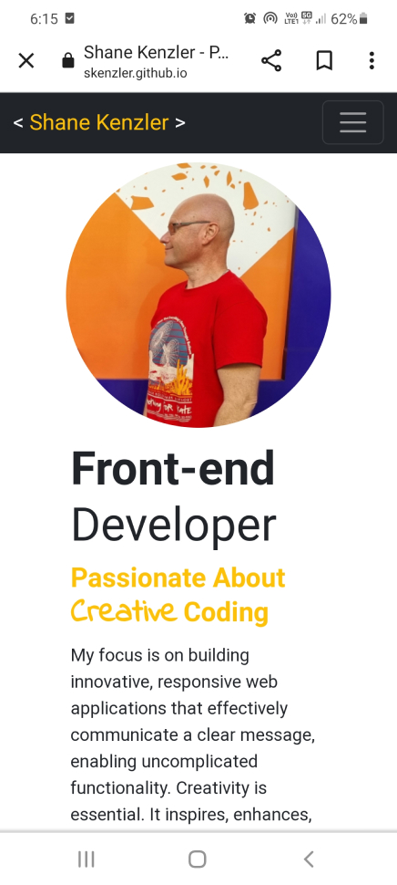

# BOOTSTRAP 5 PORTFOLIO

## About The Project

An online portfolio of work built with Bootstrap 5. The porfolio is responsive and includes examples of work. The webpage enables the user to download a copy of my resume. There are also links to resources commonly used for inspiration and learning. 

## Built With

* HTML5
* CSS3
* Bootstrap 5

## License

Distributed under the MIT License. See `LICENSE.txt` for more information.

## Contact
1. Shane Kenzler <shanekenzler@gmail.com>

## Acknowledgments

* [Github](https://github.com)
* [Figma](https://www.figma.com)
* [VS Code](https://code.visualstudio.com)
* [Bootstrap 5](https://getbootstrap.com/)
